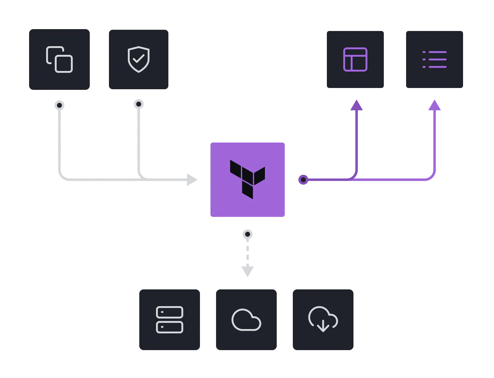

# 🏗 IaaC

<mark style="color:green;">**Definition**</mark>**:** Terraform is an infrastructure as code tool that lets you build, change, and version infrastructure safely and efficiently. This includes low-level components like compute instances, storage, and networking; and high-level components like DNS entries and SaaS features.

<figure><figcaption>
Image Source: Terraform Doc
</figcaption></figure>
