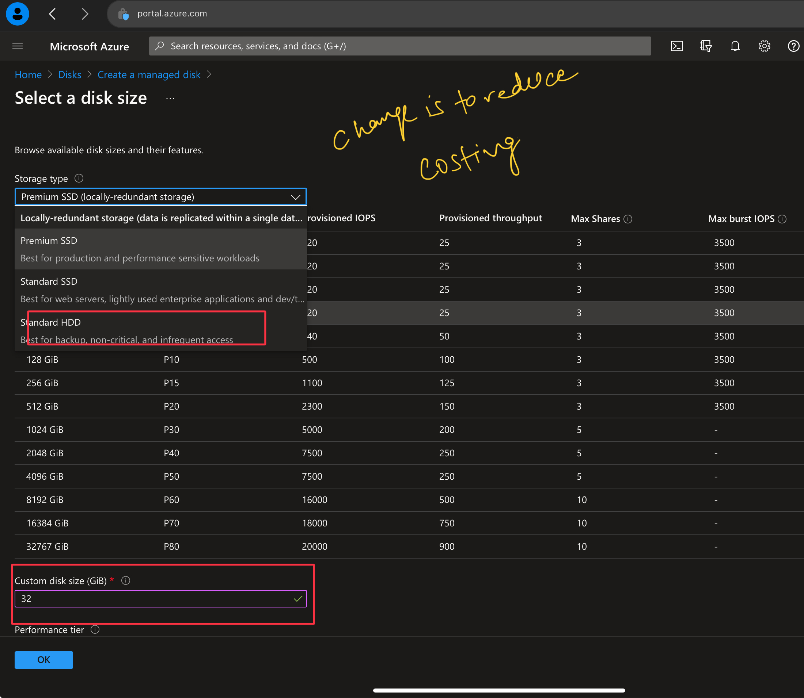

# Task 1


All resources having same life cycle ideally should belong to same Resource Group


1. Visit [Azure Portal](https://portal.azure.com) and Sign-in.
2. Click on Search-box and search for Resource Group and create a new RG
3.  Search Resource Group

    <figure><figcaption></figcaption></figure>
4. Select Subscription, Give a name to resource group then select nearest zone .Afterwards Review and Create .
5. &#x20;Click on Review and Create&#x20;
6. Search **Disk**, and click on + create&#x20;

<figure><figcaption></figcaption></figure>

7. Select your subscription and fill other details.

<figure><figcaption></figcaption></figure>

8. Change SSD to HDD and reduce Storage Size to avoid extra costing

<figure><figcaption></figcaption></figure>

9. From Encryption tab, select Platform-managed Key it means Azure will take care of Keys.

<figure><figcaption></figcaption></figure>

10. &#x20;Enable Public Access only in <mark style="color:red;">**Test**</mark> env

<figure><figcaption></figcaption></figure>

11. Don't enabled shared Disk option, because we do have to move this resource from 1 resource group to another.

<figure><figcaption></figcaption></figure>

12. &#x20;If you have any Tags, put there or else feel free to keep it blank.

<figure><figcaption></figcaption></figure>
