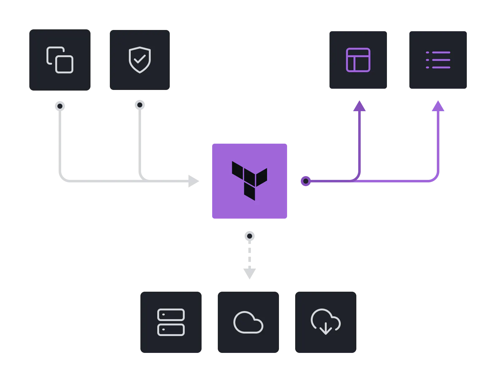

# Task 1


All resources having same life cycle ideally should belong to same Resource Group


1. Visit [Azure Portal](https://portal.azure.com) and Sign-in.
2. Click on Search-box and search for Resource Group and create a new RG
3.

    <figure><figcaption></figcaption></figure>
4. Select Subscription, Give a name to resource group  then select nearest zone .Afterwards Review and Create .
5.  &#x20;

    <figure><figcaption></figcaption></figure>
6. Search **Disk**, and click on + create&#x20;

<figure><figcaption></figcaption></figure>

7.

    <figure><figcaption></figcaption></figure>

    <figure><figcaption></figcaption></figure>

    9\.
8.

    <figure><figcaption></figcaption></figure>

<figure><figcaption></figcaption></figure>

<figure><figcaption></figcaption></figure>

<figure><figcaption></figcaption></figure>
